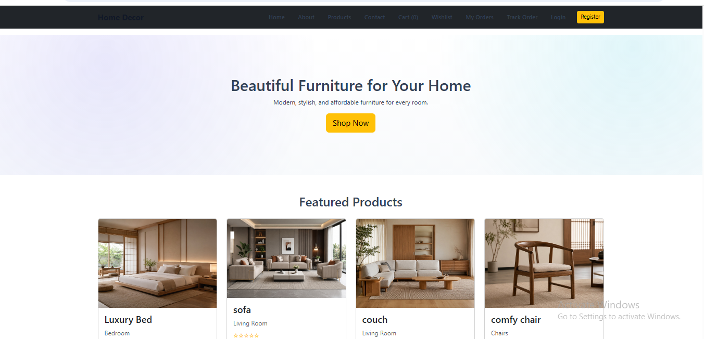

# Home Decor Django Project

A home decor e-commerce website built using Python and Django.

## Features

- User registration and login
- Product listing
- Shopping cart
- Wishlist
- Checkout
- Coupon system
- Order management

## Technologies Used

- Python
- Django
- HTML
- CSS
- JavaScript
- SQLite
- 

## Installation

```bash
pip install -r requirements.txt
python manage.py migrate
python manage.py runserver
